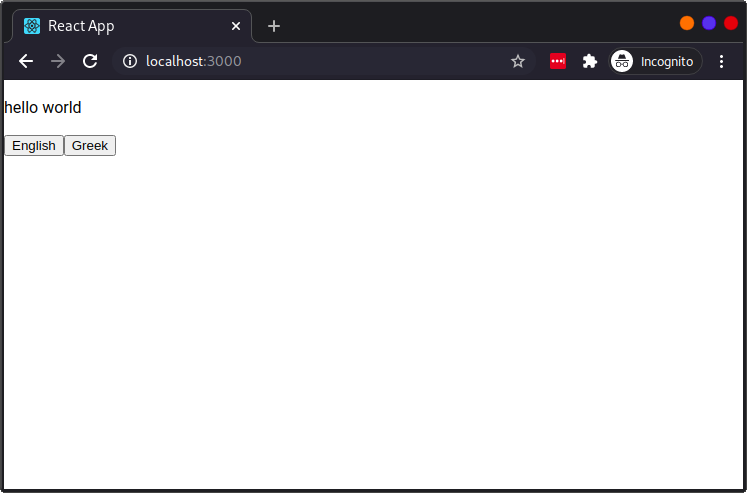
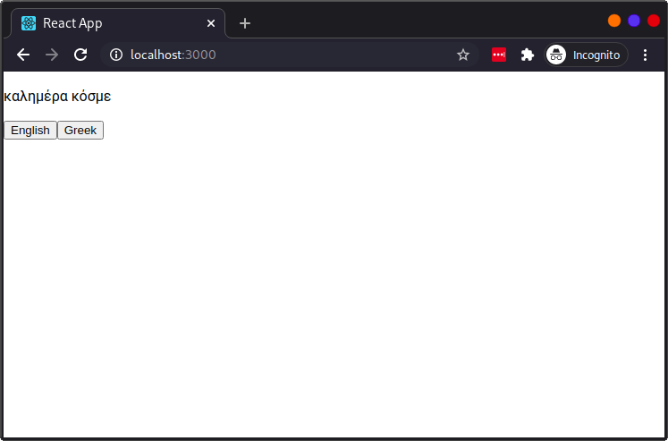
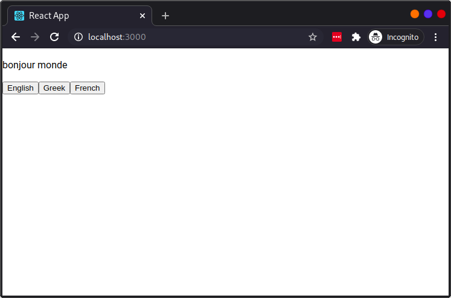

We start with a Project in Transifex. It has one target language:


One resource:


And no source strings:


We have made sure we have the `REACT_APP_TRANSIFEX_SECRET` and
`REACT_APP_TRANSIFEX_TOKEN` environment variables. They are linked to the
transifex resource. The `REACT_APP_` prefix is so that the react application
can [resolve them](https://create-react-app.dev/docs/adding-custom-environment-variables/)
in client code.

We create a new react application, install our dependencies and start our
application:

```sh
$ npx create-react-app txnative-demo
$ cd txnative-demo
$ npm install --save @transifex/native @transifex/react @transifex/cli
$ npm run start
```

We empty the `src/App.js` file and replace its contents with:

```jsx
import React from 'react';

import { tx } from '@transifex/native';
import { T } from '@transifex/react';

tx.init({ token: process.env.REACT_APP_TRANSIFEX_TOKEN, sourceLocale: 'en' });

function App() {
  return (
    <>
      <p><T _str="hello world" /></p>
    </>
  );
}

export default App;
```


Not terribly exciting. Lets add a simple language picker.

```diff
 import React from 'react';
 
 import { tx } from '@transifex/native';
 import { T } from '@transifex/react';
 
 tx.init({ token: process.env.REACT_APP_TRANSIFEX_TOKEN, sourceLocale: 'en' });
 
 function App() {
   return (
     <>
       <p><T _str="hello world" /></p>
+      <button onClick={() => tx.setCurrentLocale('en')}>English</button>
+      <button onClick={() => tx.setCurrentLocale('el')}>Greek</button>
     </>
   );
 }
 
 export default App;
```



We click on 'Greek' ... nothing happens.

Lets open a terminal and run:

```sh
npx txjs-cli push \
    --token=$REACT_APP_TRANSIFEX_TOKEN \
    --secret=$REACT_APP_TRANSIFEX_SECRET \
    --verbose \
    src
```

```
Parsing all files to detect translatable content...
⸨████████████████████████████████████████⸩ 5/5 /src/setupTests.js
✓ Processed 5 file(s) and found 1 translatable phrases.
✓ Content detected in 1 file(s).
/src/App.js
  └─ adb6d4ba2eded700fd14e66100fcf268: hello world
    └─ occurrences: ["/src/App.js"]
Uploading content to Transifex... Success
✓ Successfully pushed strings to Transifex.
Created strings: 1
Updated strings: 0
Skipped strings: 0
Deleted strings: 0
Failed strings: 0
Errors: 0
```

We just pushed our T-marked string to Transifex. Lets visit the translation
editor:


An untranslated string! Quick! Translate it!


Now lets refresh our react application and click on 'Greek':




As we click between 'English' and 'Greek', the components rerender to reflect
the language change. No refresh of the application needed!

Lets now make our language switcher a bit more automated:

```diff
-import React from 'react';
+import React, { useState, useEffect } from 'react';
 
 import { tx } from '@transifex/native';
 import { T } from '@transifex/react';
 
 tx.init({ token: process.env.REACT_APP_TRANSIFEX_TOKEN, sourceLocale: 'en' });
 
 function App() {
+  const [languages, setLanguages] = useState([]);
+  useEffect(() => {
+    async function fetch() { setLanguages(await tx.getLanguages()); }
+    fetch();
+  }, []);
   return (
     <>
       <p><T _str="hello world" /></p>
       <button onClick={() => tx.setCurrentLocale('en')}>English</button>
-      <button onClick={() => tx.setCurrentLocale('el')}>Greek</button>
+      {languages.map(({ code, name }) => (
+        <button key={code} onClick={() => tx.setCurrentLocale(code)}>
+          {name}
+        </button>
+      ))}
     </>
   );
 }
 
 export default App;
```

Well, nothing changed, but now the list of supported languages is fetched from
Transifex. Keep in mind that this is the last time we touch the code of the
react application. Lets go in transifex and add a new language:


And translate it:


And reload the application:



The application now works with French. And we didn't have to touch the code.
